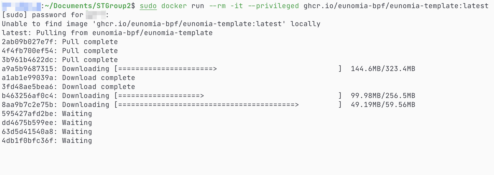
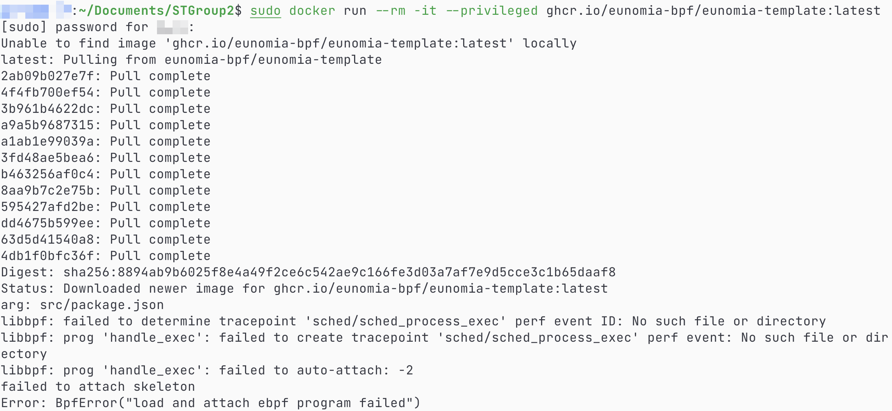
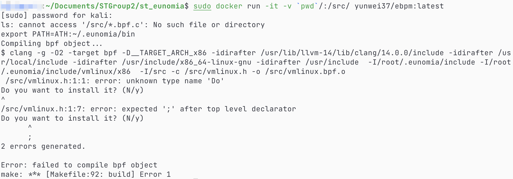

# 1. Introduction

This project is written to test another project about monitoring Linux kernel indices, a assignment of Software Testing from College of Software, NKU.

Old Tested Project: [https://github.com/Asher459/ST_lab](https://github.com/Asher459/ST_lab)

New Tested Project: [https://github.com/Asher459/st_eunomia](https://github.com/Asher459/st_eunomia)

Original Tested Project: [https://github.com/eunomia-bpf/eunomia-template](https://github.com/eunomia-bpf/eunomia-template)

## 1.1 实验目的

1. 测试系统中的各个功能模块是否满足项目要求，并测试是否存在 bug。预期达到能够使系统进行快速的改进和系统的提高。为了在软件投入真实场景运行之前，尽可能多地发现系统的错误;
2. 确保系统完成了所要求或公布的功能，并且可以访问到的功能都有明确的书面说明， 包括使用说明，接口说明，部署说明;
3. 确保系统满足功能和性能的要求;
4. 确保系统是健壮的和适应环境的。

## 1.2 实验对象

Linux主机eBPF监控。

## 1.3 实验任务

开发组需要提供部署说明，接口说明，使用说明等必要的系统使用说明;测试组需要充分 了解测试对象，仔细阅读、分析系统使用说明和项目实践要求，对待测系统的部署、功能. 性能等进行分析，制订测试计划。

## 1.4 实验内容

1. 组内交流。阅读、讨论系统使用说明，分析、研究待测系统;
2. 制定部署测试策略，确定测试实验环境等工作重点;
3. 制定功能测试策略，确定测试方法、重点待测功能等实验内容;
4. 制定单元测试策略，确定测试方法、重点待测代码等实验内容;
5. 制定性能测试策略，确定测试方法、压力负载测试等实验内容;
7. 讨论测试工作具体分工及进度安排，然后按计划进行测试工作;
8. 完成里程碑测试工作后，根据测试结果和缺陷记录，编写测试报告。

## 1.5 实验要求

实验测试应包括的内容，但不限于:


1. 系统基本情况:系统运行环境、资源;
2. 课程实践说明:所要测试的功能项、侧重点;
3. 测试策略设计:描述如何高效、完善地开展测试;
4. 测试资源配置:各测试阶段的任务、所需的资源;
5. 测试结果记录:各测试阶段的测试案例、缺陷说明等。

# 2. Procedures

Explain the procedures unfolded for software testing as well as details inside each procedure.

## 2.1 部署测试

### 2.1.1 测试目的

为了完成软件测试工作所必需的计算机硬件、软件、网络设备等的总称，确定系统是否成功安装 / 部署。稳定和可控的测试环境，可以使测试人员花费较少的时间就完成测 试用例的执行，无需为测试用例、测试过程的维护花费额外的时间，并且可以保证每一个 被提交的缺陷都可以在任何时候被准确的重现。

### 2.1.2 测试任务

- 由开发组提供尽可能详尽的部署说明，针对测试对象，基于部署说明进行部署测试；
- 测试能否成功部署系统，以完成后续测试。并记录测试过程、结果，完成测试报告的部署测试部分。

### 2.1.3 测试内容与步骤

1. 利用人工审查或评估等方法来验证部署说明是否完整、准确; 
2. 验证部署过程中异常情况的处理是否合理、准确; 
3. 验证部署后，系统是否能够正常运行;
4. 完成测试报告的部署测试部分，主要包括测试过程、测试难点、异常情况等。

### 2.1.4 结果展示

Dependencies:
- docker, container: ghcr.io/eunomia-bpf/eunomia-template:latest
- [direnv](https://github.com/direnv/direnv), [nix](https://github.com/NixOS/nix)

```bash
# 1. Deploy the project on Docker.
sudo docker run --rm -it --privileged ghcr.io/eunomia-bpf/eunomia-template:latest

# 2. Deploy the project on local host.
# Get started.
sudo apt update && sudo apt install -y direnv
curl -sfL https://direnv.net/install.sh | bash  # sh <(curl -L https://nixos.org/nix/install) --daemon
direnv allow
# Clone repository.
git clone --depth 1 https://github.com/Asher459/st_eunomia.git
# Install dependencies.
sudo apt update && \
sudo apt install -y --no-install-recommends libelf1 libelf-dev zlib1g-dev make clang llvm
# Build the project.
make build
# Run the project.
ecli run src/package.json

# Or run with Github Packages locally.
docker run --rm -it --privileged -v $(pwd):/examples ghcr.io/eunomia-bpf/eunomia-template:latest
```

Deployment test on Docker is failed, images as below.





Deployment test on another Docker container is failed again, images as below.



Here are deployment test on local host. Use script: `./src/deploy.sh` to get result.

## 2.2 功能测试

### 2.2.1 测试目的

1. 掌握黑盒测试原理、过程和测试用例的设计方法;
2. 按功能要求对系统进行测试，确保系统以期望的方式运行。

### 2.2.2 测试工具

Selenium IDE for Web end.

### 2.2.3 测试任务

针对测试对象，按照课程实践说明进行功能测试，测试范围覆盖待测功能的全部页面。
采用黑盒测试方法，执行测试、并记录测试过程、结果，完成测试报告的功能测试部分。

### 2.2.4 测试内容与步骤

1. 分析测试对象，整理待测模块，形成测试用例;
2. 使用测试工具，对每个测试用例进行测试，记录测试通过和缺陷情况;
3. 完成测试报告的功能测试部分，主要包括测试过程、测试用例、缺陷情况等。

### 2.2.5 结果展示

Use script: `./src/function.sh` to get result.

## 2.3 单元测试

### 2.3.1 测试目的

1. 掌握白盒测试原理、过程和测试用例的设计方法;
2. 测试软件系统中的最小可测试单元(即模块、类、方法等)是否按照预期工作，验证代码的正确性，确保软件系统的正确性和可靠性。

### 2.3.2 测试工具

Python中常用的单元测试框架：

- **unittest**
- pytest

### 2.3.3 测试任务

针对测试对象，按照课程实践说明进行单元测试，对于其中的模块、函数单元，分别依据语句覆盖准则和分支覆盖准则，设计测试用例。利用单元测试框架(任选)批量执行这些测试用例，记录测试时间、用例、覆盖率，验证所设计的测试用例是否输出了所要求的覆盖准则的完全覆盖、是否发现缺陷，完成测试报告的单元测试部分。

### 2.3.4 测试内容与步骤

1. 分析测试对象，整理待测模块，形成测试用例;
2. 使用测试工具，对每个测试用例进行测试，记录测试覆盖率、通过和缺陷情况;
3. 完成测试报告的单元测试部分，主要包括测试覆盖率、测试用例、缺陷情况等。

### 2.3.5 代码分析

分析 `template.h` 和 `template.c` 文件功能如下：

这两段代码是使用eBPF技术编写的用于跟踪进程创建和退出事件的内核模块。模块可以捕获跟踪事件和进程元数据，并将其提交到环形缓冲区以供用户空间进程分析。以下是两个函数的简要说明：

1. `handle_exec`：此函数用于处理`sched_process_exec`事件，该事件在进程执行新程序时发生。函数在处理事件时获取进程元数据，例如PID、PPID、进程命令和执行文件名，并将其打包成`event`结构，然后将其提交到环形缓冲区以供后续分析。
2. `handle_exit`：此函数用于处理`sched_process_exit`事件，该事件在进程退出时发生。函数在处理事件时获取进程元数据，例如PID、PPID、退出代码和持续时间，并将其打包成`event`结构，然后将其提交到环形缓冲区以供后续分析。

这些函数使用BPF映射来存储正在跟踪的进程的元数据。它们还使用BPF环形缓冲区来存储和提交事件数据。这些函数利用了eBPF技术的优点，即在内核中运行，以最小化跨空间的开销，并使用安全的BPF虚拟机保护内核免受恶意代码的攻击。

```c++
/* SPDX-License-Identifier: (LGPL-2.1 OR BSD-2-Clause) */
/* Copyright (c) 2020 Facebook */
#ifndef __BOOTSTRAP_H
#define __BOOTSTRAP_H

#define TASK_COMM_LEN 16
#define MAX_FILENAME_LEN 127

struct event {
	int pid;
	int ppid;
	unsigned exit_code;
	unsigned long long duration_ns;
	char comm[TASK_COMM_LEN];
	char filename[MAX_FILENAME_LEN];
	bool exit_event;
};

#endif /* __BOOTSTRAP_H */
```
```c++
// SPDX-License-Identifier: GPL-2.0 OR BSD-3-Clause
/* Copyright (c) 2020 Facebook */
#include "vmlinux.h"
#include <bpf/bpf_helpers.h>
#include <bpf/bpf_tracing.h>
#include <bpf/bpf_core_read.h>
#include "template.h"

char LICENSE[] SEC("license") = "Dual BSD/GPL";

struct {
	__uint(type, BPF_MAP_TYPE_HASH);
	__uint(max_entries, 8192);
	__type(key, pid_t);
	__type(value, u64);
} exec_start SEC(".maps");

struct {
	__uint(type, BPF_MAP_TYPE_RINGBUF);
	__uint(max_entries, 256 * 1024);
} rb SEC(".maps");

const volatile unsigned long long min_duration_ns = 0;

SEC("tp/sched/sched_process_exec")
int handle_exec(struct trace_event_raw_sched_process_exec *ctx)
{
	struct task_struct *task;
	unsigned fname_off;
	struct event *e;
	pid_t pid;
	u64 ts;

	/* remember time exec() was executed for this PID */
	pid = bpf_get_current_pid_tgid() >> 32;
	ts = bpf_ktime_get_ns();
	bpf_map_update_elem(&exec_start, &pid, &ts, BPF_ANY);

	/* don't emit exec events when minimum duration is specified */
	if (min_duration_ns)
		return 0;

	/* reserve sample from BPF ringbuf */
	e = bpf_ringbuf_reserve(&rb, sizeof(*e), 0);
	if (!e)
		return 0;

	/* fill out the sample with data */
	task = (struct task_struct *)bpf_get_current_task();

	e->exit_event = false;
	e->pid = pid;
	e->ppid = BPF_CORE_READ(task, real_parent, tgid);
	bpf_get_current_comm(&e->comm, sizeof(e->comm));

	fname_off = ctx->__data_loc_filename & 0xFFFF;
	bpf_probe_read_str(&e->filename, sizeof(e->filename), (void *)ctx + fname_off);

	/* successfully submit it to user-space for post-processing */
	bpf_ringbuf_submit(e, 0);
	return 0;
}

SEC("tp/sched/sched_process_exit")
int handle_exit(struct trace_event_raw_sched_process_template* ctx)
{
	struct task_struct *task;
	struct event *e;
	pid_t pid, tid;
	u64 id, ts, *start_ts, duration_ns = 0;
	
	/* get PID and TID of exiting thread/process */
	id = bpf_get_current_pid_tgid();
	pid = id >> 32;
	tid = (u32)id;

	/* ignore thread exits */
	if (pid != tid)
		return 0;

	/* if we recorded start of the process, calculate lifetime duration */
	start_ts = bpf_map_lookup_elem(&exec_start, &pid);
	if (start_ts)
		duration_ns = bpf_ktime_get_ns() - *start_ts;
	else if (min_duration_ns)
		return 0;
	bpf_map_delete_elem(&exec_start, &pid);

	/* if process didn't live long enough, return early */
	if (min_duration_ns && duration_ns < min_duration_ns)
		return 0;

	/* reserve sample from BPF ringbuf */
	e = bpf_ringbuf_reserve(&rb, sizeof(*e), 0);
	if (!e)
		return 0;

	/* fill out the sample with data */
	task = (struct task_struct *)bpf_get_current_task();

	e->exit_event = true;
	e->duration_ns = duration_ns;
	e->pid = pid;
	e->ppid = BPF_CORE_READ(task, real_parent, tgid);
	e->exit_code = (BPF_CORE_READ(task, exit_code) >> 8) & 0xff;
	bpf_get_current_comm(&e->comm, sizeof(e->comm));

	/* send data to user-space for post-processing */
	bpf_ringbuf_submit(e, 0);
	return 0;
}
```

分析 `tcp.h` 和 `tcp.c` 文件功能如下：

这两段代码使用eBPF技术实现了跟踪TCP连接事件的内核模块。tcp.h 和 tcp.c 中定义了用于存储事件数据的结构体`tcp_conn_event`。该结构体包含了事件的时间戳、源IP地址、目的IP地址、源端口、目的端口和连接类型。tcp.c 中的`trace_tcp_connect`函数使用kprobe跟踪`tcp_v4_connect`函数的调用，并从TCP套接字中提取IP和TCP头以填充`tcp_conn_event`结构。该函数使用`bpf_perf_event_output`函数将事件数据发送到用户空间。

`tcp.h` 和 `tcp.c` 的实现可以参考了以下函数：

- `trace_tcp_connect`：此函数使用kprobe跟踪`tcp_v4_connect`函数的调用，并提取IP和TCP头以填充`tcp_conn_event`结构。该函数使用`bpf_perf_event_output`函数将事件数据发送到用户空间。

```c++
#ifndef _TCP_H
#define _TCP_H

#include <linux/types.h>


struct tcp_conn_event {
    __u64 timestamp_ns;
    __be32 saddr;
    __be32 daddr;
    __be16 sport;
    __be16 dport;
    __u32 conn_type;
};

#endif /* _TCP_H */
```
```c++
#include "tcp.h"
#include <linux/bpf.h>
#include <linux/tcp.h>
#include <linux/ptrace.h>
#include <linux/ip.h>

#include <bpf/bpf_helpers.h>
#include <bpf/bpf_tracing.h>
#include <bpf/bpf_core_read.h>
#include <bpf/libbpf.h>


struct {
    __uint(type, BPF_MAP_TYPE_PERF_EVENT_ARRAY);
    __uint(key_size, sizeof(int));
    __uint(value_size, sizeof(int));
} tcp_conn_events SEC(".maps");

SEC("kprobe/tcp_v4_connect")

int trace_tcp_connect(struct pt_regs *ctx) {
    struct tcp_conn_event event = {};
    struct sock *skp = NULL;
    struct tcphdr *tcph = NULL;
    struct iphdr *iph = NULL;

    // Get the socket from the function argument
    skp = (struct sock *)PT_REGS_PARM1(ctx);

    // Extract IP and TCP headers
    iph = (struct iphdr *)((__u32 *)skp + 1);
    tcph = (struct tcphdr *)(iph + 1);

    // Fill in the event data
    event.timestamp_ns = bpf_ktime_get_ns();
    event.saddr = iph->saddr;
    event.daddr = iph->daddr;
    event.sport = tcph->source;
    event.dport = tcph->dest;
    event.conn_type = 0; // 0 for connection setup

    // Send the event to userspace
    bpf_perf_event_output(ctx, &tcp_conn_events, BPF_F_CURRENT_CPU, &event, sizeof(event));

    return 0;
}

char _license[] SEC("license") = "GPL";
```

### 2.3.6 单元测试及结果

使用unittest对生成可执行的c文件进行单元测试，测试过程陈述和结果如下。

(1) To unit test `template.h` and `template.c` using Python, you can use the `unittest` module in Python to write test cases. Here are the general steps to follow:

1. Write test cases that exercise the functionality of the code. This may involve creating some test data to use in the tests.
2. Import the code into the test module using the `import` statement.
3. Write test methods that call the functions in the code and compare the expected results with the actual results using assertions.
4. Use the `unittest` module's test runner to run the test methods.

This test case creates a trace_event_raw_sched_process_exec object and some test data, mocks the BPF functions, and calls the handle_exec function. It then checks that the event was added to the ring buffer correctly.

(2) To unit test `tcp.h` and `tcp.c` using Python, you can use the `unittest` module in Python to write test cases. Here are the general steps to follow:

## 2.4 性能测试

### 2.4.1 测试目的

1. 掌握性能测试原理、过程和测试设计方法;
2. 对系统进行性能测试，评估系统在不同负载情况下的性能表现。

### 2.4.2 测试工具

**JMeter:** 是一个开源的性能测试工具，它可以对各种不同类型的应用进行性能测试，包括 Web 应用、数据库、FTP、Web Services 等。JMeter 支持多线程测试，并可以模拟多种 不同的用户行为和负载情况，可以评估系统在不同负载下的性能表现。JMeter 具有易学易用、功能强大、可扩展性好等特点，可以在不同的操作系统平台上 运行，并支持多种不同的语言和插件，可以满足不同用户的需求。

JMeter 主要有以下功能：
1. 负载测试:可以模拟多种不同的用户行为和负载情况，评估系统在不同负载下的性能表现。
2. 功能测试:可以对应用的各项功能进行测试，并支持多种不同类型的协议，包括 HTTP、FTP、JDBC、SMTP 等。
3. 报告生成:可以生成各种类型的测试报告，包括 HTML、XML、CSV 等格式，帮助用户更好地了解测试结果和性能瓶颈。

安装参考文档如下：

- [Official Document](https://jmeter.apache.org/usermanual/get-started.html)
- [https://blog.csdn.net/Deng872347348/article/details/126953048](https://blog.csdn.net/Deng872347348/article/details/126953048)
- [JMeter and Selunium Configuration Blog](https://www.baeldung.com/selenium-jmeter)

### 2.4.3 测试任务

针对测试对象，按照课程实践说明进行性能测试，测试范围覆盖所有待测功能。采用性能测试方法，执行测试、并记录测试过程、结果，完成测试报告的性能测试部分。

### 2.4.4 测试内容与步骤

1. 安装配置 JMeter，使用 JMeter GUI 编写并调试测试脚本。(可参照附件中对百度搜索的测试代码块编写对被测系统的测试脚本文件)
2. 设置 JMeter 线程数，使用 JMeter CLI 完成测试，生成 results.txt 以及 web report
3. 完成测试报告的性能测试部分，主要包括测试过程、测试结果、缺陷情况等。

### 2.4.5 结果展示

The installation is only about JMeter, for the sake that web end is not avaible for the test repo.

# 3. Usage

Explain how to use script codes to accomplish unit and performance tests.

```bash
# Enable execution permission.
chmod +x ./src/*

# 1. Deploy test
./src/deploy.sh

# 2. Function test
./src/function.sh

# 3. Unit test
python3 ./src/unittest1.py
python3 ./src/unittest2.py

# 4. Performance test
```